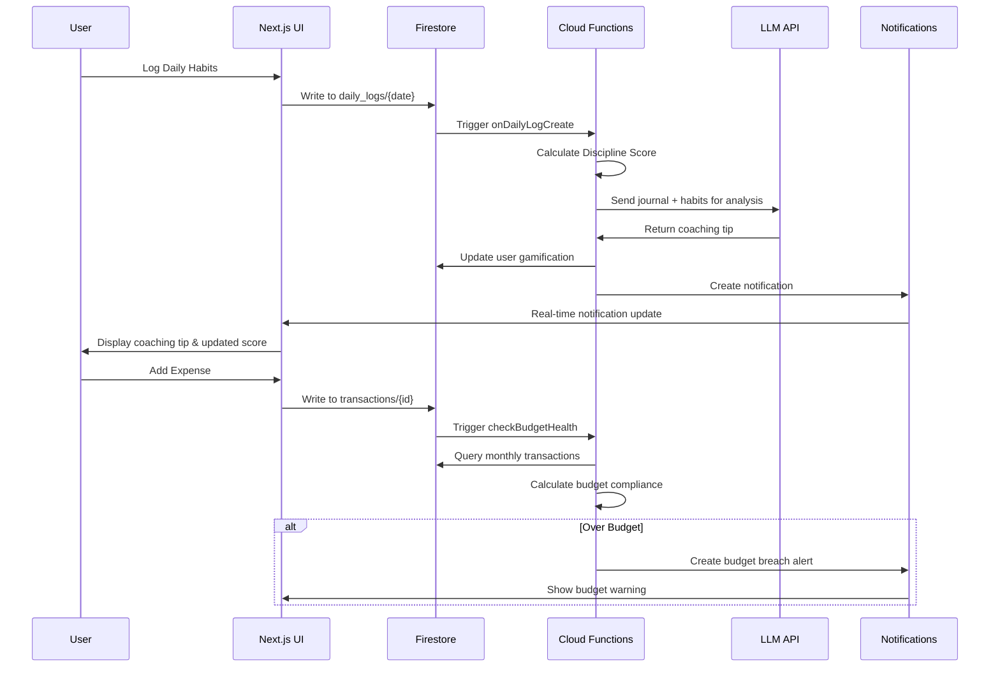

# 🏗️ Personal Development System (PDS) - Technical Specification

## Project File Structure

```
sudo-me-pds/
├── README.md
├── package.json
├── next.config.js
├── tailwind.config.js
├── tsconfig.json
├── .env.local
├── .gitignore
├── firebase.json
├── firestore.rules
├── functions/
│   ├── package.json
│   ├── src/
│   │   ├── index.ts
│   │   ├── triggers/
│   │   │   ├── onDailyLogCreate.ts
│   │   │   ├── checkBudgetHealth.ts
│   │   │   └── weeklyReviewJob.ts
│   │   └── utils/
│   │       ├── llm.ts
│   │       └── calculations.ts
├── src/
│   ├── app/
│   │   ├── layout.tsx
│   │   ├── page.tsx
│   │   ├── dashboard/
│   │   │   └── page.tsx
│   │   ├── habits/
│   │   │   └── page.tsx
│   │   ├── finance/
│   │   │   └── page.tsx
│   │   ├── fitness/
│   │   │   └── page.tsx
│   │   └── career/
│   │       └── page.tsx
│   ├── components/
│   │   ├── ui/
│   │   │   ├── button.tsx
│   │   │   ├── card.tsx
│   │   │   ├── input.tsx
│   │   │   ├── progress.tsx
│   │   │   └── modal.tsx
│   │   ├── dashboard/
│   │   │   ├── DisciplineScore.tsx
│   │   │   ├── PhaseIndicator.tsx
│   │   │   └── QuickLogModal.tsx
│   │   ├── habits/
│   │   │   ├── MorningChecklist.tsx
│   │   │   └── HabitTracker.tsx
│   │   ├── finance/
│   │   │   ├── BudgetTracker.tsx
│   │   │   ├── ExpenseForm.tsx
│   │   │   └── InvestmentAllocation.tsx
│   │   ├── fitness/
│   │   │   ├── WorkoutLogger.tsx
│   │   │   ├── WaterTracker.tsx
│   │   │   └── ProgressChart.tsx
│   │   └── career/
│   │       ├── LeetCodeTracker.tsx
│   │       ├── CertificationProgress.tsx
│   │       └── DeepWorkTimer.tsx
│   ├── lib/
│   │   ├── firebase.ts
│   │   ├── validations.ts
│   │   ├── constants.ts
│   │   └── utils.ts
│   ├── hooks/
│   │   ├── useDisciplineScore.ts
│   │   ├── usePhaseDetection.ts
│   │   ├── useBudgetHealth.ts
│   │   └── useFirestore.ts
│   ├── types/
│   │   ├── user.ts
│   │   ├── habits.ts
│   │   ├── finance.ts
│   │   ├── fitness.ts
│   │   └── career.ts
│   └── store/
│       ├── authStore.ts
│       └── uiStore.ts
```

## Core Business Logic Constants

```typescript
// lib/constants.ts
export const PHASE_CONFIG = {
  FOUNDATION: { start: 1, end: 30, name: 'Foundation' },
  INTENSITY: { start: 31, end: 60, name: 'Intensity' },
  MASTERY: { start: 61, end: 90, name: 'Mastery' }
} as const;

export const BUDGET_LIMITS = {
  ESSENTIALS: 30000,
  WANTS: 10000,
  INVESTMENTS: 20000,
  SAVINGS: 20000,
  GOALS: 15000
} as const;

export const DISCIPLINE_WEIGHTS = {
  wakeUpTime: 0.3,
  noPhoneFirstHour: 0.25,
  coldShower: 0.2,
  meditation: 0.15,
  planTomorrowDone: 0.1
} as const;

export const FITNESS_TARGETS = {
  WEEKLY_GYM_SESSIONS: 4,
  WEEKLY_CARDIO_SESSIONS: 2,
  DAILY_WATER_OZ: 128, // 1 gallon
  TARGET_LEETCODE_TOTAL: 300
} as const;

export const INVESTMENT_ALLOCATION = {
  LOW_RISK: 0.3,
  MID_RISK: 0.4,
  HIGH_RISK: 0.3
} as const;
```

## Zod Validation Schemas

```typescript
// lib/validations.ts
import { z } from 'zod';

export const UserProfileSchema = z.object({
  uid: z.string(),
  email: z.string().email(),
  name: z.string().min(1),
  startDate: z.date(),
  targetWeight: z.number().positive(),
  currentSalary: z.number().positive(),
  targetSalary: z.number().min(2000000), // 20 LPA minimum
});

export const DailyLogSchema = z.object({
  date: z.string().regex(/^\d{4}-\d{2}-\d{2}$/),
  habits: z.object({
    wokeUpAt6am: z.boolean(),
    coldShower: z.boolean(),
    noPhoneFirstHour: z.boolean(),
    meditated: z.boolean(),
    plannedTomorrow: z.boolean(),
  }),
  fitness: z.object({
    workoutType: z.enum(['Gym', 'Run', 'Calisthenics', 'Swim', 'Rest']),
    waterIntakeOz: z.number().min(0).max(200),
    sleepHours: z.number().min(0).max(12),
  }),
  learning: z.object({
    leetCodeSolved: z.number().min(0),
    pagesRead: z.number().min(0),
    studyHours: z.number().min(0).max(8),
  }),
  journal: z.object({
    impulseControlRating: z.number().min(1).max(5),
    notes: z.string().max(1000),
  }),
});

export const TransactionSchema = z.object({
  amount: z.number().positive(),
  category: z.enum(['Essentials', 'Wants', 'Investments', 'Savings', 'Goals']),
  description: z.string().min(1).max(200),
  timestamp: z.date(),
}).refine((data) => {
  // Budget validation logic
  if (data.category === 'Essentials' && data.amount > 30000) {
    return false;
  }
  if (data.category === 'Wants' && data.amount > 10000) {
    return false;
  }
  return true;
}, {
  message: "Transaction exceeds budget limits",
});

export type UserProfile = z.infer<typeof UserProfileSchema>;
export type DailyLog = z.infer<typeof DailyLogSchema>;
export type Transaction = z.infer<typeof TransactionSchema>;
```

## Custom Hook: Discipline Score Calculator

```typescript
// hooks/useDisciplineScore.ts
import { useMemo } from 'react';
import { DISCIPLINE_WEIGHTS } from '@/lib/constants';
import type { DailyLog } from '@/lib/validations';

export function useDisciplineScore(dailyLog: DailyLog | null) {
  return useMemo(() => {
    if (!dailyLog) return 0;

    const { habits } = dailyLog;
    let score = 0;

    // Wake up time scoring (6:00 AM = 100%, later = penalty)
    score += habits.wokeUpAt6am ? DISCIPLINE_WEIGHTS.wakeUpTime * 100 : 0;
    
    // Boolean habits
    score += habits.noPhoneFirstHour ? DISCIPLINE_WEIGHTS.noPhoneFirstHour * 100 : 0;
    score += habits.coldShower ? DISCIPLINE_WEIGHTS.coldShower * 100 : 0;
    score += habits.meditated ? DISCIPLINE_WEIGHTS.meditation * 100 : 0;
    score += habits.plannedTomorrow ? DISCIPLINE_WEIGHTS.planTomorrowDone * 100 : 0;

    return Math.round(score);
  }, [dailyLog]);
}
```

## Firestore Security Rules

```javascript
// firestore.rules
rules_version = '2';
service cloud.firestore {
  match /databases/{database}/documents {
    // Users can only access their own data
    match /users/{userId} {
      allow read, write: if request.auth != null && request.auth.uid == userId;
      
      // Sub-collections inherit parent permissions
      match /daily_logs/{document=**} {
        allow read, write: if request.auth != null && request.auth.uid == userId;
      }
      
      match /transactions/{document=**} {
        allow read, write: if request.auth != null && request.auth.uid == userId;
      }
      
      match /notifications/{document=**} {
        allow read, write: if request.auth != null && request.auth.uid == userId;
      }
    }
  }
}
```

## Cloud Functions

```typescript
// functions/src/triggers/onDailyLogCreate.ts
import { onDocumentCreated } from 'firebase-functions/v2/firestore';
import { getFirestore } from 'firebase-admin/firestore';
import { generateCoachingTip } from '../utils/llm';

export const onDailyLogCreate = onDocumentCreated(
  'users/{userId}/daily_logs/{logId}',
  async (event) => {
    const { userId } = event.params;
    const dailyLog = event.data?.data();
    
    if (!dailyLog) return;

    const db = getFirestore();
    
    // Update streak calculation
    const userRef = db.collection('users').doc(userId);
    const user = await userRef.get();
    const userData = user.data();
    
    // Calculate discipline score
    const disciplineScore = calculateDisciplineScore(dailyLog.habits);
    
    // Generate LLM coaching tip
    const coachingTip = await generateCoachingTip(
      dailyLog.journal.notes,
      dailyLog.habits,
      disciplineScore
    );
    
    // Update user gamification and add notification
    await Promise.all([
      userRef.update({
        'gamification.currentStreak': userData?.gamification?.currentStreak + 1 || 1,
        'gamification.totalXp': userData?.gamification?.totalXp + disciplineScore || disciplineScore,
      }),
      db.collection('users').doc(userId).collection('notifications').add({
        type: 'coaching_tip',
        content: coachingTip,
        timestamp: new Date(),
        read: false,
      })
    ]);
  }
);

function calculateDisciplineScore(habits: any): number {
  // Implementation matches the useDisciplineScore hook
  let score = 0;
  score += habits.wokeUpAt6am ? 30 : 0;
  score += habits.noPhoneFirstHour ? 25 : 0;
  score += habits.coldShower ? 20 : 0;
  score += habits.meditated ? 15 : 0;
  score += habits.plannedTomorrow ? 10 : 0;
  return score;
}
```

```typescript
// functions/src/triggers/checkBudgetHealth.ts
import { onDocumentCreated } from 'firebase-functions/v2/firestore';
import { getFirestore } from 'firebase-admin/firestore';
import { BUDGET_LIMITS } from '../utils/constants';

export const checkBudgetHealth = onDocumentCreated(
  'users/{userId}/transactions/{transactionId}',
  async (event) => {
    const { userId } = event.params;
    const transaction = event.data?.data();
    
    if (!transaction || transaction.category !== 'Essentials') return;

    const db = getFirestore();
    const currentMonth = new Date().toISOString().slice(0, 7); // YYYY-MM
    
    // Calculate monthly spending for Essentials
    const transactionsRef = db
      .collection('users')
      .doc(userId)
      .collection('transactions');
    
    const monthlyTransactions = await transactionsRef
      .where('category', '==', 'Essentials')
      .where('timestamp', '>=', new Date(`${currentMonth}-01`))
      .where('timestamp', '<', new Date(`${currentMonth}-31`))
      .get();
    
    const totalSpent = monthlyTransactions.docs.reduce(
      (sum, doc) => sum + doc.data().amount,
      0
    );
    
    // Check if over budget
    if (totalSpent > BUDGET_LIMITS.ESSENTIALS) {
      await db.collection('users').doc(userId).collection('notifications').add({
        type: 'budget_breach',
        content: {
          category: 'Essentials',
          spent: totalSpent,
          limit: BUDGET_LIMITS.ESSENTIALS,
          overage: totalSpent - BUDGET_LIMITS.ESSENTIALS,
        },
        timestamp: new Date(),
        read: false,
        severity: 'high',
      });
    }
  }
);
```

## System Architecture Diagram



## Key Features Implementation

### 1. Phase Detection Hook
```typescript
// hooks/usePhaseDetection.ts
import { useMemo } from 'react';
import { PHASE_CONFIG } from '@/lib/constants';

export function usePhaseDetection(startDate: Date) {
  return useMemo(() => {
    const today = new Date();
    const daysSinceStart = Math.floor(
      (today.getTime() - startDate.getTime()) / (1000 * 60 * 60 * 24)
    ) + 1;

    if (daysSinceStart <= PHASE_CONFIG.FOUNDATION.end) {
      return { phase: 'FOUNDATION', day: daysSinceStart };
    } else if (daysSinceStart <= PHASE_CONFIG.INTENSITY.end) {
      return { phase: 'INTENSITY', day: daysSinceStart };
    } else {
      return { phase: 'MASTERY', day: daysSinceStart };
    }
  }, [startDate]);
}
```

### 2. Monk Mode Toggle
```typescript
// store/uiStore.ts
import { create } from 'zustand';

interface UIStore {
  monkMode: boolean;
  toggleMonkMode: () => void;
}

export const useUIStore = create<UIStore>((set) => ({
  monkMode: false,
  toggleMonkMode: () => set((state) => ({ monkMode: !state.monkMode })),
}));
```

### 3. Quick Log Modal Component
```typescript
// components/dashboard/QuickLogModal.tsx
import { useState } from 'react';
import { useForm } from 'react-hook-form';
import { zodResolver } from '@hookform/resolvers/zod';
import { DailyLogSchema, type DailyLog } from '@/lib/validations';

export function QuickLogModal({ isOpen, onClose }: { isOpen: boolean; onClose: () => void }) {
  const { register, handleSubmit, formState: { errors } } = useForm<DailyLog>({
    resolver: zodResolver(DailyLogSchema),
  });

  const onSubmit = async (data: DailyLog) => {
    // Submit to Firestore
    console.log('Submitting daily log:', data);
    onClose();
  };

  if (!isOpen) return null;

  return (
    <div className="fixed inset-0 bg-black bg-opacity-50 flex items-center justify-center">
      <div className="bg-white p-6 rounded-lg max-w-md w-full">
        <h2 className="text-xl font-bold mb-4">Daily Log</h2>
        <form onSubmit={handleSubmit(onSubmit)} className="space-y-4">
          {/* Habit checkboxes */}
          <div className="space-y-2">
            <label className="flex items-center">
              <input type="checkbox" {...register('habits.wokeUpAt6am')} />
              <span className="ml-2">Woke up at 6 AM</span>
            </label>
            <label className="flex items-center">
              <input type="checkbox" {...register('habits.coldShower')} />
              <span className="ml-2">Cold Shower</span>
            </label>
            <label className="flex items-center">
              <input type="checkbox" {...register('habits.noPhoneFirstHour')} />
              <span className="ml-2">No Phone First Hour</span>
            </label>
            <label className="flex items-center">
              <input type="checkbox" {...register('habits.meditated')} />
              <span className="ml-2">Meditated (10 min)</span>
            </label>
          </div>

          {/* Quick inputs */}
          <div className="grid grid-cols-2 gap-4">
            <input
              type="number"
              placeholder="LeetCode solved"
              {...register('learning.leetCodeSolved', { valueAsNumber: true })}
              className="border p-2 rounded"
            />
            <input
              type="number"
              placeholder="Water (oz)"
              {...register('fitness.waterIntakeOz', { valueAsNumber: true })}
              className="border p-2 rounded"
            />
          </div>

          <textarea
            placeholder="Journal notes..."
            {...register('journal.notes')}
            className="w-full border p-2 rounded h-20"
          />

          <div className="flex gap-2">
            <button type="submit" className="bg-blue-500 text-white px-4 py-2 rounded">
              Save Log
            </button>
            <button type="button" onClick={onClose} className="bg-gray-300 px-4 py-2 rounded">
              Cancel
            </button>
          </div>
        </form>
      </div>
    </div>
  );
}
```

## Deployment Configuration

### Firebase Configuration
```json
{
  "hosting": {
    "public": "out",
    "ignore": ["firebase.json", "**/.*", "**/node_modules/**"],
    "rewrites": [
      {
        "source": "**",
        "destination": "/index.html"
      }
    ]
  },
  "functions": {
    "source": "functions",
    "runtime": "nodejs18"
  },
  "firestore": {
    "rules": "firestore.rules"
  }
}
```

### Next.js Configuration
```javascript
// next.config.js
/** @type {import('next').NextConfig} */
const nextConfig = {
  output: 'export',
  trailingSlash: true,
  images: {
    unoptimized: true
  }
}

module.exports = nextConfig
```

This technical specification provides a complete foundation for building the Personal Development System (PDS) application. The architecture is designed to be:

1. **Cost-effective**: Uses Firebase free tier and serverless functions
2. **Scalable**: Modular design allows easy expansion
3. **Data-driven**: Comprehensive tracking and analytics
4. **Intelligent**: LLM integration for personalized coaching
5. **Secure**: Proper authentication and data isolation
6. **Mobile-ready**: Responsive design for future mobile app development

The system enforces the 90-day transformation plan through code, making it impossible to cheat or skip important metrics while providing intelligent feedback and motivation through AI-powered coaching.